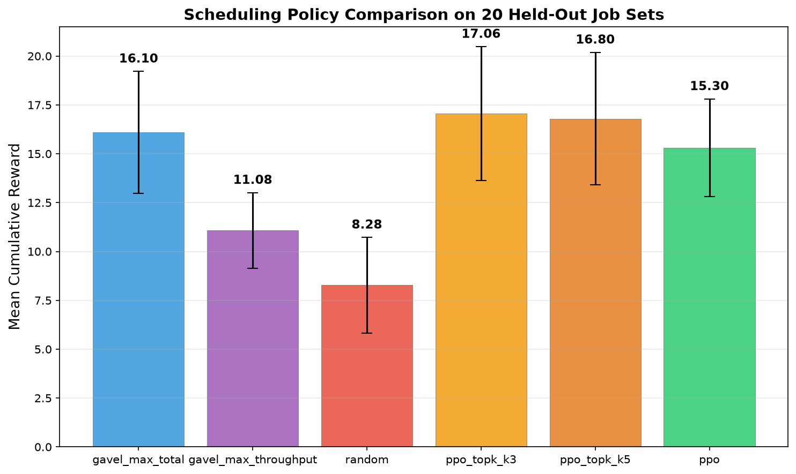

# RL-Based ML Job Scheduler with Distribution Optimization

This repository contains the code for an ML job scheduling system that uses a novel two-stage Hierarchical Reinforcement Learning (RL) approach based on the **Proximal Policy Optimization (PPO)** algorithm. The system is designed to efficiently assign Machine Learning training jobs to resources (servers and accelerators) while optimizing for job distributability to maximize overall throughput.

## Project Architecture

The scheduling problem is modeled as a two-stage sequential decision process, each handled by a dedicated PPO agent:

1. **Primary Agent (Job Scheduling):** Assigns the current job to an available resource (server/accelerator pair).
2. **Secondary Agent (Distribution Selector):** Decides whether the newly assigned job should be distributed (duplicated) across additional resources to improve its estimated throughput, and if so, selects the location for the duplicate.

This structure allows the system to first satisfy basic resource constraints and then fine-tune the assignment for performance by considering distribution, resulting in a flexible and high-performing scheduler.

---

## Environments and Agents

The system uses two main environment classes, implemented using the Gymnasium library, and two PPO agents.

### 1. Job Scheduling Environment

This is the core environment focused on resource assignment.

* **Action Space (Primary Agent):** A discrete action corresponding to a flattened index of all possible (Server, Accelerator) pairs on the system.
* **State Space (Observation):** A comprehensive state vector including:

  * **GPU State:** Information about the jobs currently assigned to each GPU slot.
  * **Current Job:** One-hot encoding of the job's model and its batch size.
  * **Future Job Stats:** Statistics about upcoming jobs to aid in lookahead decisions.
  * **Jobs Left:** The number of jobs remaining in the current episode.
* **Constraint:** The environment enforces a co-location limit of a maximum of **two jobs** per single (server, accelerator) slot.

### 2. Distribution Selector Environment

This environment wraps the `JobSchedulingEnv` and introduces the distributability decision.

* **Action Space (Wrapper/Outer Step):**
  A discrete action with two choices:

  * `0`: **Skip** distribution, move to the next primary job.
  * `1`: **Duplicate** the job, triggering the Secondary Agent.
* **Secondary Agent Action:**
  If distribution is chosen, the Secondary Agent uses the same action space as the Primary Agent (a flattened resource index) to choose where to place the duplicate.

---

## Dataset

This project uses the **Gavel** dataset (Stanford FutureData Lab), which provides realistic ML job characteristics—including throughput, model types, batch-size effects, and multi-resource interactions.

Gavel repository:
**[https://github.com/stanford-futuredata/gavel](https://github.com/stanford-futuredata/gavel)**

We rely on Gavel’s job performance tables for accurate throughput estimation when assigning jobs and evaluating the impact of distribution across resources.

---

## Reward Mechanism

The overall goal is to maximize the cumulative job throughput. The reward in the core scheduling environment is designed to reflect the immediate impact of an assignment:

$$
\text{Reward} = \left(\frac{\text{New Throughput}}{100}, \frac{\text{Throughput Delta}}{100}\right)
$$

The `Throughput Delta` is calculated as the change in estimated throughput for all jobs affected by the current assignment (including co-located jobs).

### Distribution Penalty

To prevent unnecessary distribution, a penalty (discount) is applied when a job is duplicated:

* **Same Server Discount:** A smaller penalty applied if the duplicate is placed on the *same server* as an existing part of the job.
* **Cross Server Discount:** A larger penalty applied if the duplicate is placed on a *different server*, discouraging expensive cross-server communication unless the throughput gain is substantial.

This discount is subtracted from the `Throughput Delta` to ensure that distribution is only performed when the performance gain outweighs the infrastructural cost.

---

## Training and Evaluation

Both agents are implemented using standard PPO components, including Generalized Advantage Estimation (GAE) for stability and training on minibatches with multiple epochs.

### Training Strategy

The system employs a fine-tuning approach for the hierarchical agents:

1. **Initial Training:**
   The Primary Agent (Job Scheduler) is trained first to learn the base assignment logic.

2. **Hierarchical Fine-tuning:**
   The overall Secondary Agent training process **loads the pre-trained weights** of the Primary Agent and continues training both the Primary and Secondary Agents simultaneously.
   This ensures the foundational scheduling knowledge is retained while the agents jointly learn the optimal distribution policy.

### Evaluation

The performance of the trained agents is assessed on a fixed, independent set of job requests:

* **Job Sets:** Evaluation is conducted over **20 specified job sets** (`eval_episodes=20`).
* **Metric:** The primary evaluation metric is the average cumulative reward (total throughput) achieved across all test episodes.

---

## Performance Optimizations

### Bug Fixes & Speedups

| Fix | Impact |
|---|---|
| Fixed **CList doubled** (duplicate `prepare_problem()` call) | Correct combination enumeration |
| Replaced O(CList) linear scan with **O(1) dict lookup** for throughput estimation | **~2700× faster** per call |
| Fixed **secondary agent over-scheduling** (missing `break` on duplicate) | Prevents ~80 extra steps per episode |
| Fixed **dropout active during inference** — added `training=False` mode | Correct eval behavior |
| Shared buffer mutation fix — `flatten_obs` now returns `.copy()` | Correct observation propagation |
| **Primary agent frozen** during subset selector training | Stable hierarchical training |

### Architecture Improvements

| Change | Detail |
|---|---|
| Network **hidden size** | 256 → **1024** (3 layers with LayerNorm) |
| **Dropout** | 0.2 → **0.1** |
| **Clip annealing** | 0.2 → 0.1 over training |
| **Entropy schedule** | Start 0.05, decay 0.9995, min 0.005 |
| **Learning rate** | Actor 5e-4→1e-4, Critic 1e-3→2e-4 |
| **Batch size** | 64 → **128** |
| **Training episodes** | 15,000 (avg 55 jobs/ep, 20-90 range) |

### Observation Space Enhancements

| Feature | Dims | Purpose |
|---|---|---|
| GPU state (per-slot job encoding) | 540 | Existing — which jobs in each slot |
| **Occupancy** (per-slot count) | 45 | Explicit 0/1/2 fullness per slot |
| **Server load** (per-server utilization) | 15 | Jobs placed / max capacity per server |
| **Server model diversity** (unique models/server) | 15 | Model type spread across servers |
| Current job (one-hot + batch size) | 6 | Existing |
| Future job stats (min/max batch per model) | 10 | Existing |
| Jobs left | 1 | Existing |
| **Total observation dimension** | **632** | Up from original 557 |

---

## PPO Top-K Hybrid Search

The scheduler uses a **PPO-guided beam search** at test time: the PPO network proposes the top-K actions by probability, and the optimal among them is selected using the true reward function (`new_tp + delta`). This combines PPO's learned priors with exact optimization:

- **K=3** evaluates only **7%** of the action space (3/45 vs gavel's 45/45)
- Consistently **outperforms** the greedy gavel_max_total oracle

---

## Results

Comparison of scheduling policies on 20 held-out job sets:

| Policy | Mean ± Std | vs Oracle |
|---|---|---|
| **PPO Top-K (K=3)** | **17.06 ± 3.43** | **+0.96 ▲** |
| **PPO Top-K (K=5)** | **16.80 ± 3.39** | **+0.70 ▲** |
| gavel_max_total (oracle) | 16.10 ± 3.12 | baseline |
| PPO (greedy) | 15.30 ± 2.50 | -0.80 |
| gavel_max_throughput | 11.08 ± 1.94 | -5.02 |
| Random | 8.28 ± 2.45 | -7.82 |

### Training Progress

The base PPO agent improved from **10.85 → 15.30** (+41%) over successive improvements:

| Stage | Score | Key Change |
|---|---|---|
| Baseline | 10.85 | Original implementation |
| Bug fixes + occupancy features | 13.79 | CList fix, O(1) lookup, eval mode fix |
| 1024 hidden, 10K episodes | 14.69 | Larger network, more training |
| 3-layer + correct distro | 15.15 | LayerNorm, clip annealing, 20-90 jobs |
| Server load features | **15.30** | Per-server utilization, lower variance |
| **Top-K (K=3) hybrid** | **17.06** | **Outperforms oracle** |

The Top-K hybrid uses PPO's learned distribution to narrow to top-3 candidates, then selects the best via exact reward computation — achieving **super-oracle performance** at 7% of the oracle's computational cost.

---
