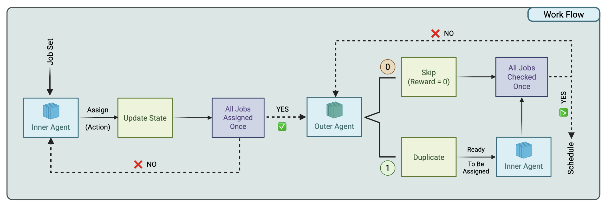

# RL-Based ML Job Scheduler with Distribution Optimization

This repository contains the code for an ML job scheduling system that uses a novel two-stage Hierarchical Reinforcement Learning (RL) approach based on the **Proximal Policy Optimization (PPO)** algorithm. The system is designed to efficiently assign Machine Learning training jobs to resources (servers and accelerators) while optimizing for job distributability to maximize overall throughput.

## Project Architecture

The scheduling problem is modeled as a two-stage sequential decision process, each handled by a dedicated PPO agent:

1.  **Primary Agent (Job Scheduling):** Assigns the current job to an available resource (server/accelerator pair).
2.  **Secondary Agent (Distribution Selector):** Decides whether the newly assigned job should be distributed (duplicated) across additional resources to improve its estimated throughput, and if so, selects the location for the duplicate.

This structure allows the system to first satisfy basic resource constraints and then fine-tune the assignment for performance by considering distribution, resulting in a flexible and high-performing scheduler.

***

## Environments and Agents

The system uses two main environment classes, implemented using the Gymnasium library, and two PPO agents.

### 1. Job Scheduling Environment 

This is the core environment focused on resource assignment.

* **Action Space (Primary Agent):** A discrete action corresponding to a flattened index of all possible (Server, Accelerator) pairs on the system.
* **State Space (Observation):** A comprehensive state vector including:
    * **GPU State:** Information about the jobs currently assigned to each GPU slot.
    * **Current Job:** One-hot encoding of the job's model and its batch size.
    * **Future Job Stats:** Statistics about upcoming jobs to aid in lookahead decisions.
    * **Jobs Left:** The number of jobs remaining in the current episode.
* **Constraint:** The environment enforces a co-location limit of a maximum of **two jobs** per single (server, accelerator) slot.

### 2. Distribution Selector Environment

This environment wraps the `JobSchedulingEnv` and introduces the distributability decision.

* **Action Space (Wrapper/Outer Step):** A discrete action with two choices:
    * `0`: **Skip** distribution, move to the next primary job.
    * `1`: **Duplicate** the job, triggering the Secondary Agent.
* **Secondary Agent Action:** If distribution is chosen, the Secondary Agent uses the same action space as the Primary Agent (a flattened resource index) to choose where to place the duplicate.

***

## Reward Mechanism

The overall goal is to maximize the cumulative job throughput. The reward in the core scheduling environment is designed to reflect the immediate impact of an assignment:

$$
\text{Reward} = \left(\frac{\text{New Throughput}}{100}, \frac{\text{Throughput Delta}}{100}\right)
$$

The `Throughput Delta` is calculated as the change in estimated throughput for all jobs affected by the current assignment (including co-located jobs).

### Distribution Penalty

To prevent unnecessary distribution, a penalty (discount) is applied when a job is duplicated:

* **Same Server Discount ($\text{dist\_discount\_same}$):** A smaller penalty applied if the duplicate is placed on the *same server* as an existing part of the job.
* **Cross Server Discount ($\text{dist\_discount\_cross}$):** A larger penalty applied if the duplicate is placed on a *different server*, discouraging expensive cross-server communication unless the throughput gain is substantial.

This discount is subtracted from the `Throughput Delta` to ensure that distribution is only performed when the performance gain outweighs the infrastructural cost.

***

## Training and Evaluation

Both agents are implemented using standard PPO components, including Generalized Advantage Estimation (GAE) for stability and training on minibatches with multiple epochs.

### Training Strategy

The system employs a fine-tuning approach for the hierarchical agents:

1.  **Initial Training:** The Primary Agent (Job Scheduler) is trained first to learn the base assignment logic.
2.  **Hierarchical Fine-tuning:** The overall Secondary Agent training process **loads the pre-trained weights** of the Primary Agent and continues training both the Primary and Secondary Agents simultaneously. This ensures the foundational scheduling knowledge is retained while the agents jointly learn the optimal distribution policy.

### Evaluation

The performance of the trained agents is assessed on a fixed, independent set of job requests:

* **Job Sets:** Evaluation is conducted over **20 specified job sets** (`eval_episodes=20`).
* **Metric:** The primary evaluation metric is the average cumulative reward (total throughput) achieved across all test episodes.

