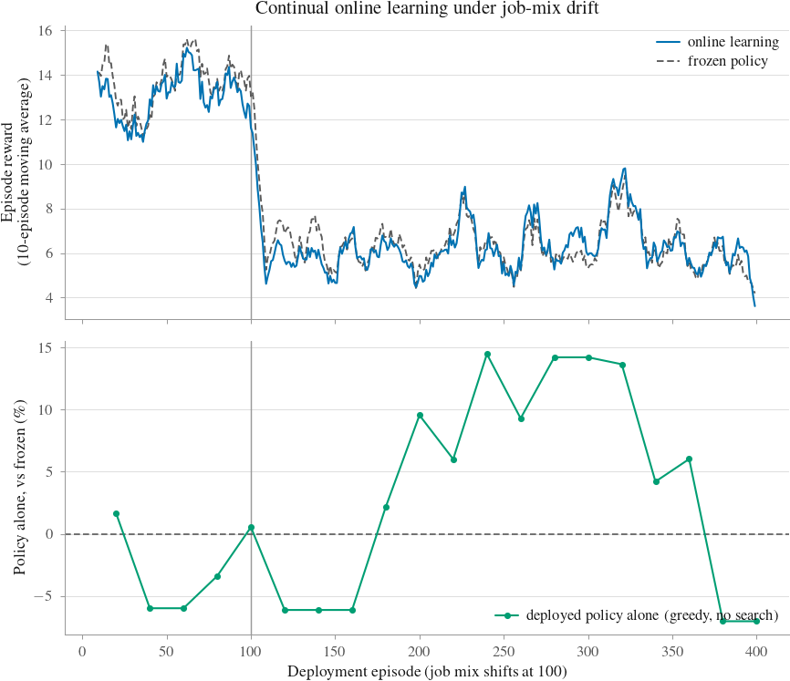
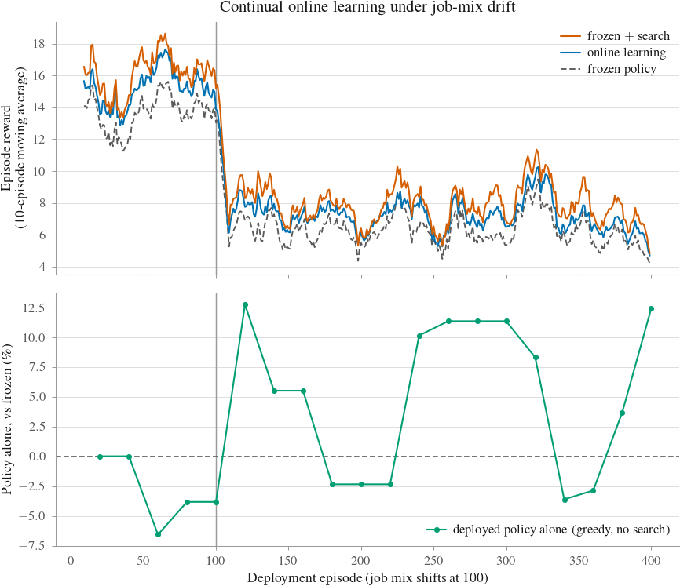

# RL-Based ML Job Scheduler with Distribution Optimization

This repository contains the code for an ML job scheduling system that uses a novel two-stage Hierarchical Reinforcement Learning (RL) approach based on the **Proximal Policy Optimization (PPO)** algorithm. The system is designed to efficiently assign Machine Learning training jobs to resources (servers and accelerators) while optimizing for job distributability to maximize overall throughput.

## Setup and Requirements

- **Python 3.10+** with `pip install -r requirements.txt` (`gymnasium`, `numpy`, `torch`, `matplotlib`, `scipy`).
  SciPy is needed only by `scripts/sia_baseline.py`, which solves Sia's allocation ILP with `scipy.optimize.milp`.
- **`data/physical_all.json` (474 KB, Gavel throughput table)** is committed at the repository root
  and loaded at runtime by `nero/envs/problem.py`. Without it the environments cannot
  construct the throughput model.
- **`data/saved_job_sets/`** (committed) — the 20 fixed held-out job sets used for every evaluation.
- Device is auto-selected in `nero/agents/ppo.py`: `cuda` → `mps` → `cpu`.

See **Quick Start** below for the commands to rerun the project, and
**Reproducing Everything from Scratch** for a detailed step-by-step walkthrough.

## How to Run

### The protocol every model follows

One convention, applied everywhere in this repository:

| | |
|---|---|
| **Training** | **randomly generated job sets** (`Train_JobSchedulingEnv`, 20–90 jobs drawn from the 24 job types). No script trains on `data/saved_job_sets/` — for the reward model this is enforced by an assertion in the collection loop, not left to convention. |
| **Model selection** | a separate **validation** stream of randomly generated job sets (`python -m scripts.evaluate --validation 40`), drawn with a seed used for no training and no reporting. Choices between configurations — the search's `K`, scoring mode and canonicalisation mode — are made here. |
| **Testing** | the **20 held-out sets** in `data/saved_job_sets/`, walked in deterministic order (`set_000` … `set_019`), one episode each. Used only to report. |
| **Test-time policy** | **greedy masked arg max** — the action mask comes from `Base_JobSchedulingEnv.feasible_slots`, the single definition of feasibility in the project, and the highest-probability feasible action is played. Sampling, dropout and exploration are all off. |
| **Metric** | mean episode throughput reward over the 20 test sets. |

The top-K policies follow the same rule with one extra step: the greedy arg max
becomes "rank by the policy, then pick among the top $K$ by score". Everything else —
masking, determinism, the 20 sets — is unchanged.

**The reward model never sees the test sets.** Its labels come only from randomly
generated job sets; `data/saved_job_sets/` appears in `scripts/train_reward_model.py` solely to read
the observation dimensions and to print a final score. The shipped configuration
(`K=5`, myopic scoring, deduplicating canonicalisation) is the one validation selects —
16.23 there, against 15.79 for `K=3`, 15.22 for the one-step lookahead, 15.00 for the
expanding candidate set and 13.07 for the Q-head alone.

### Commands

From a clean clone with `data/physical_all.json` and `data/saved_job_sets/` in place:

```bash
# 0. environment
pip install -r requirements.txt

# --- training (all on randomly generated job sets) -------------------------
# 1. inner placement agent           -> models/job_scheduling/ppo/            (~15.15)
python -m scripts.train_inner

# 2. outer duplication agent         -> models/subset_selector/ppo/           (~17.91)
python -m scripts.train_outer        #    also fine-tunes ppo/secondary/

# 3. oracle-free scoring heads       -> models/job_scheduling/learned_topk/   (~17.48)
python -m scripts.train_reward_model         #    reward model + value head + Q-head

# 4. continual online learning       -> models/job_scheduling/online/         (optional)
python -m scripts.online_learning
python -m scripts.online_learning --use-topk --out-dir models/job_scheduling/online_topk --tag topk

# --- evaluation (all on the 20 held-out sets, greedy) ----------------------
# 5. every policy + baseline         -> results/job_scheduling/evaluation_scores_*.json
python -m scripts.evaluate
python -m scripts.sia_baseline

# 6. figures
python -m scripts.figure_data           # measurements the report figures need
python -m scripts.figures          # -> paper/images/report_*.pdf

# 7. latency + correctness guards
python -m scripts.benchmark
```

Run from the repository root, in order: step 2 reads step 1's weights, step 3 reads step 1's,
step 4 reads step 3's, and steps 5–7 read everything above. Steps 3–4 are only needed for the
oracle-free top-K and online-learning results; the two-tier pipeline does not depend on them.

### Self-checks

Three claims in this project are verified rather than asserted, each runnable on its own:

```bash
python -m nero.search.canonicalization    # slot equivalence classes are exact vs the true reward
python -m nero.search.fast_obs            # the delta-built next observation matches env.step
python -m scripts.benchmark        # the learned search never reads the throughput table,
                                     # and canonicalised top-K == plain top-K
```

### Model selection

`data/saved_job_sets/` is the test set and nothing is tuned on it. To choose between
configurations, score them on randomly generated validation sets instead:

```bash
python -m scripts.evaluate --validation 40
```

This writes `results/job_scheduling/validation_scores.json`. Its numbers are a
selection tool, not results — the reported figures always come from the 20 test sets.

## Project Architecture

The scheduling problem is modeled as a two-stage sequential decision process, each handled by a dedicated PPO agent:

1. **Primary Agent (Job Scheduling):** Assigns the current job to an available resource (server/accelerator pair).
2. **Secondary Agent (Distribution Selector):** Decides whether the newly assigned job should be distributed (duplicated) across additional resources to improve its estimated throughput, and if so, selects the location for the duplicate.

This structure allows the system to first satisfy basic resource constraints and then fine-tune the assignment for performance by considering distribution, resulting in a flexible and high-performing scheduler.


---

## Environments and Agents

The system uses two main environment classes, implemented using the Gymnasium library, and two PPO agents.

### 1. Job Scheduling Environment

This is the core environment focused on resource assignment.

* **Action Space (Primary Agent):** A discrete action corresponding to a flattened index of all possible (Server, Accelerator) pairs on the system.
* **State Space (Observation):** A comprehensive state vector including:

  * **GPU State:** Information about the jobs currently assigned to each GPU slot.
  * **Current Job:** One-hot encoding of the job's model and its batch size.
  * **Future Job Stats:** Statistics about upcoming jobs to aid in lookahead decisions.
  * **Jobs Left:** The number of jobs remaining in the current episode.
* **Constraint:** The environment enforces a co-location limit of a maximum of **two jobs** per single (server, accelerator) slot.

### 2. Distribution Selector Environment

This environment wraps the `JobSchedulingEnv` and introduces the distributability decision.

* **Action Space (Wrapper/Outer Step):**
  A discrete action with two choices:

  * `0`: **Skip** distribution, move to the next primary job.
  * `1`: **Duplicate** the job, triggering the Secondary Agent.
* **Secondary Agent Action:**
  If distribution is chosen, the Secondary Agent uses the same action space as the Primary Agent (a flattened resource index) to choose where to place the duplicate.

---

## Dataset

This project uses the **Gavel** dataset (Stanford FutureData Lab), which provides realistic ML job characteristics—including throughput, model types, batch-size effects, and multi-resource interactions.

Gavel repository:
**[https://github.com/stanford-futuredata/gavel](https://github.com/stanford-futuredata/gavel)**

We rely on Gavel’s job performance tables for accurate throughput estimation when assigning jobs and evaluating the impact of distribution across resources. The tables are materialized in `data/physical_all.json` at the repository root (24 job types × 3 accelerator types; see Setup above).

---

## Reward Mechanism

The overall goal is to maximize the cumulative job throughput. The reward in the core scheduling environment is designed to reflect the immediate impact of an assignment:

$$
\text{Reward} = \left(\frac{\text{New Throughput}}{100}, \frac{\text{Throughput Delta}}{100}\right)
$$

The `Throughput Delta` is calculated as the change in estimated throughput for all jobs affected by the current assignment (including co-located jobs).

### Distribution Penalty

To prevent unnecessary distribution, a penalty (discount) is applied when a job is duplicated:

* **Same Server Discount:** A smaller penalty applied if the duplicate is placed on the *same server* as an existing part of the job.
* **Cross Server Discount:** A larger penalty applied if the duplicate is placed on a *different server*, discouraging expensive cross-server communication unless the throughput gain is substantial.

This discount is subtracted from the `Throughput Delta` to ensure that distribution is only performed when the performance gain outweighs the infrastructural cost.

---

## Training and Evaluation

Both agents are implemented using standard PPO components, including Generalized Advantage Estimation (GAE) for stability and training on minibatches with multiple epochs.

### Training Strategy

The system employs a fine-tuning approach for the hierarchical agents:

1. **Initial Training:**
   The Primary Agent (Job Scheduler) is trained first to learn the base assignment logic.

2. **Hierarchical Fine-tuning:**
   The overall Secondary Agent training process **loads the pre-trained weights** of the Primary Agent and continues training both the Primary and Secondary Agents simultaneously.
   This ensures the foundational scheduling knowledge is retained while the agents jointly learn the optimal distribution policy.

### Evaluation

The performance of the trained agents is assessed on a fixed, independent set of job requests:

* **Job Sets:** Evaluation is conducted over **20 specified job sets** (`eval_episodes=20`, files `data/saved_job_sets/set_000.json` … `set_019.json`).
* **Metric:** The primary evaluation metric is the average cumulative reward (total throughput) achieved across all test episodes.
* **Scripts:** `scripts/evaluate.py` re-runs random, the two Gavel greedy baselines, greedy PPO, oracle top-K (K=3/5), the oracle-free learned top-K (K=3/5 plus its ablations), the continually-updated online policy, and the trained two-tier (subset-selector) system; `scripts/sia_baseline.py` re-runs the four Sia configurations. Both overwrite `results/job_scheduling/evaluation_scores_*.json` and print a `vs-committed diff` per policy to catch any drift from the reported numbers.
* **Online use:** Decisions require only the observable state (GPU occupancy, job model/batch size, queue statistics); no throughput table is queried at decision time. Inference runs in eager fp32 on CPU (see `nero/deployment.py`, benchmarked by `scripts/benchmark.py`): inner forward pass ≈ 0.11 ms, full placement decision ≈ 0.54 ms, outer duplication decision ≈ 0.10 ms (M3 CPU medians; absolute values move with machine and load — see **Decision latency** for a same-run comparison). The oracle-free top-K search adds ≈ 0.08 ms on top of a greedy placement decision and is the higher-scoring deployment path. The inner forward pass is faster than the oracle's raw table lookups (~0.27 ms/decision) while requiring no throughput information — the `gavel_max_total` oracle needs exact true throughputs (including co-location interference) at runtime and therefore serves only as an offline upper bound.

---

## Performance Optimizations

### Bug Fixes & Speedups

| Fix | Impact |
|---|---|
| Fixed **CList doubled** (duplicate `prepare_problem()` call) | Correct combination enumeration |
| Replaced O(CList) linear scan with **O(1) dict lookup** for throughput estimation | **~2700× faster** per call |
| Fixed **secondary agent over-scheduling** (missing `break` on duplicate) | Prevents ~80 extra steps per episode |
| Fixed **dropout active during inference** — added `training=False` mode | Correct eval behavior |
| Shared buffer mutation fix — `flatten_obs` now returns `.copy()` | Correct observation propagation |
| **Primary agent frozen** during subset selector training | Stable hierarchical training |

### Architecture Improvements

| Change | Detail |
|---|---|
| Network **hidden size** | 256 → **1024** (3 layers with LayerNorm) |
| **Dropout** | 0.2 → **0.1** |
| **Clip annealing** | 0.2 → 0.1 over training |
| **Entropy schedule** | Start 0.05, decay 0.9995, min 0.005 |
| **Learning rate** | Actor 5e-4→1e-4, Critic 1e-3→2e-4 |
| **Batch size** | 64 → **128** |
| **Training episodes** | 15,000 (avg 55 jobs/ep, 20-90 range) |

### Observation Space Enhancements

| Feature | Dims | Purpose |
|---|---|---|
| GPU state (per-slot job encoding) | 540 | Existing — which jobs in each slot |
| **Occupancy** (per-slot count) | 45 | Explicit 0/1/2 fullness per slot |
| **Server load** (per-server utilization) | 15 | Jobs placed / max capacity per server |
| **Server model diversity** (unique models/server) | 15 | Model type spread across servers |
| Current job (one-hot + batch size) | 6 | Existing |
| Future job stats (min/max batch per model) | 10 | Existing |
| Jobs left | 1 | Existing |
| **Total observation dimension** | **632** | Up from original 557 |

---

## Top-K Search: Oracle-Assisted and Oracle-Free

At test time the scheduler runs a **PPO-guided beam search**: the policy proposes the top-K slots
by probability and the best of them is played. This pairs PPO's long-horizon prior (which slots
are worth considering) with an explicit evaluation (which of them pays most right now), and
**K=3 evaluates only 7% of the action space** (3/45 vs gavel's 45/45).

Everything hinges on what does the evaluating.

### Oracle-assisted (`ppo_topk_k3/k5`) — an offline upper bound

The committed top-K policies score candidates with the environment's true reward
`new_tp + delta`, read straight out of the Gavel throughput tables. A live cluster does not know
the co-location interference of a placement it has not made yet, so this is an **upper bound**,
not a deployable scheduler — the same caveat as `gavel_max_total`.

### Oracle-free (`ppo_topk_learned_k3/k5`) — the deployable version

`nero/search/topk.py` runs the identical search with every oracle lookup replaced by something
computable from observable state:

| Step | Oracle-assisted | Oracle-free |
|---|---|---|
| Propose | policy top-K over feasible slots | same |
| Deduplicate | — | **canonicalisation** (`nero/search/canonicalization.py`) |
| Score | `new_tp + delta` from the throughput table | **learned reward model**, optionally + value/Q head |
| Commit | `argmax` | tolerance `argmax`; exact ties resolved by policy rank |

**1. Canonicalisation.** The reward of placing job `j` at slot `(s, a)` depends on only three
observable things: the accelerator type, the co-located job together with the distribution
discount that applies to it on that server, and `j`'s own discount. Two slots sharing that key are
*exactly* reward-equivalent. `python -m nero.search.canonicalization` verifies this against the true
reward: over 5 random-action episodes, **9,476 slots collapse into 3,737 classes
(2.54 slots/class) with a maximum intra-class reward spread of 0.0**. Inside a top-5 candidate
list this cuts the work to **2.23 candidates actually scored, with provably identical
decisions** — the survivor of each class is the member the policy ranked highest, and the
members it replaces score identically (see **Decision latency**).

**2. Learned reward model.** Because the canonical key is a *sufficient statistic* for the reward,
the reward model is a small MLP over an 18-dimensional feature vector shared across all slots,
not a 632→45 network. The throughput table supplies labels **offline** (the way logged cluster
measurements would), densely: every visited state contributes a label for all ~45 feasible slots.
It reaches **98.3% agreement with the oracle's argmax** and a **mean regret of 4.5e-05** reward
units per decision — accurate enough to stand in for the table.

**3. Long-horizon heads.** A Monte-Carlo value head `V(state)` and a double-DQN `Q(state, ·)` are
also trained (`scripts/train_reward_model.py`), letting the search score `r_hat + γ·V(s')` or `Q` instead
of the myopic reward. The next state `s'` needed for the lookahead is built by
`nero/search/fast_obs.py`, which applies a placement to an observation as a delta — exact to float32
(`python -m nero.search.fast_obs` checks it against `env.step`) and **24× cheaper** than rebuilding
the observation (0.014 ms vs 0.333 ms), which is what makes a K-candidate lookahead affordable
at all.

**Result.** All numbers below are on the 20 test sets, which nothing is trained or
tuned on. The configuration was selected on validation (see **The protocol every model
follows**).

| Policy | Test (20 sets) | Δ vs learned K=5 | paired t | Oracle-free? |
|---|---|---|---|---|
| **Two-tier + search (both phases)** | **19.76 ± 3.08** | +2.27 | +1.90 | ✅ |
| Two-tier + search (primary only) | 19.24 ± 2.93 | +1.75 | +1.61 | ✅ |
| Two-tier | 17.91 ± 2.92 | +0.42 | +0.38 | ✅ |
| **Learned top-K (K=5)** | **17.48 ± 4.00** | — | — | ✅ |
| Oracle top-K (K=5) | 17.21 ± 3.84 | −0.28 | −2.06 | ❌ |
| Learned top-K (K=3) | 16.65 ± 3.19 | −0.83 | — | ✅ |
| Oracle top-K (K=3) | 16.61 ± 3.18 | −0.87 | — | ❌ |
| `gavel_max_total` (oracle) | 16.10 ± 3.20 | −1.38 | **−4.70** | ❌ |
| PPO inner agent (greedy) | 15.15 ± 3.48 | −2.33 | **−3.91** | ✅ |

The oracle-free search **reproduces** the oracle-assisted refinement it replaces
(17.48 vs 17.21 at K=5; 16.65 vs 16.61 at K=3) while reading no throughput data at
decision time, and beats the `gavel_max_total` oracle by +1.38 (t = 4.70) and the bare
policy by +2.33 (t = 3.91). Reproducing the oracle-assisted result *without* an oracle
is the claim; the +0.28 it edges ahead by at K=5 is within the noise of a 20-set
comparison and should not be read as an improvement.

### A note on model selection

Two systems here have their checkpoints chosen by a score on the test sets:
`scripts/train_inner.py` keeps the inner agent's best held-out evaluation, and
`scripts/train_outer.py` keeps the best of ~500 evaluations. That inflates those two
numbers by an amount the test sets cannot reveal. Scoring on 40 validation sets
suggests the effect is real and unequal — the two-tier system leads the search by
+0.42 on the test sets but trails it by −0.56 on validation, while the search's margin
over `gavel_max_total` holds (+1.04, t = 5.60). Every configuration introduced in this
work is therefore selected on validation; the two-tier numbers are reported as they
stand, with the caveat that **two-tier vs. search is the one comparison not to treat as
settled**.

### Combining the two: the best configuration found

The search and the two-tier system are orthogonal — the search improves *where each copy
goes*, the outer agent decides *how many copies there are*. `nero/search/two_tier.py`
leaves the outer agent exactly as trained and replaces only the **placement** step.

NERO places jobs with two different networks: the frozen **primary** policy for the initial
placement, and the fine-tuned **secondary** policy for duplicates. The search can replace
either or both:

| | initial placement | duplicate placement | Test (20 sets) |
|---|---|---|---|
| Two-tier | primary, argmax | secondary, argmax | 17.91 ± 2.92 |
| Two-tier + search (primary) | **search** | secondary, argmax | 19.24 ± 2.93 |
| **Two-tier + search (both)** | **search** | **search** | **19.76 ± 3.08** |

`subset_selector_topk_both` is **+1.85** over the two-tier baseline (t = 2.73, 13/20 sets)
and **+2.27** over the search alone. It also uses **fewer duplicates** (6.1 vs 7.5 per
episode): better placement makes duplication less necessary.

**Which policy proposes the candidates does not matter.** In the arm above, both phases
search over the *primary* policy, so the fine-tuned secondary network is bypassed rather
than re-ranked. Searching the duplicates over the secondary policy instead
(`secondary_agent=`) gives 19.78 ± 2.89 — a difference of +0.03 (t = 0.13). Once the search
selects among candidates, the secondary fine-tuning buys nothing it does not already supply.

**The primary phase is exact; the duplicate phase is an approximation.** No duplicates exist
during the initial phase, so the canonical features fully determine every candidate's reward.
Placing a *duplicate* pays `− discount(s)·(tr_orig + tr_dup)`, and `tr_orig` — the throughput
of the copy already running — is not in the feature vector. It still helps (+0.52 over
primary-only), but it is the one place where the score is knowingly incomplete. In a real
deployment `tr_orig` is measurable on the running copy and should be fed in.

### Learning the reward model online, with no prior profiling

The offline fit above is the most generous assumption in this project: it labels *every*
feasible slot of every visited state, and it sees all 24 job types. `scripts/online_reward_model.py`
removes it. The PPO policy is trained offline as usual — it never needs the tables at decision
time — and the reward model then starts from either random weights (`--init cold`) or a fit that
never saw two of the five model families (`--init partial`), and learns on live traffic under
deployment rules: **one label per decision**, the realised reward of the slot actually played,
and no table access while deciding.

```bash
python -m scripts.train_reward_model --exclude-models "ResNet-50,Transformer"     --out-dir models/job_scheduling/learned_topk_partial      # the partial fit
python -m scripts.online_reward_model --init cold
python -m scripts.online_reward_model --init partial --learned-dir models/job_scheduling/learned_topk_partial
```

Deployment stream: randomly generated job sets. Test: the 20 held-out sets, greedy, never
learned from.

| Labels observed | Cold start | Reference |
|---|---|---|
| 0 (random weights) | 12.82 | — below the bare policy |
| **1,461** (25 episodes) | **17.16** | already past `gavel_max_total` (16.10) and oracle top-K K=3 (16.61) |
| 7,295 | 17.38 | ≈ the offline-trained model (17.48) |
| 21,867 (400 episodes) | 17.22 | plateau; model MAE 0.435 → 0.013 |

**~1,500 realised labels — about 25 episodes — recover essentially all of the offline-trained
performance.** The reason the bootstrap is this cheap is the same structural fact that makes the
model small: it is one shared function of 18 inputs, not 45 independent outputs, so every
decision teaches it something that transfers to every slot.

**A second, less obvious result.** The partial model — which never saw ResNet-50 or Transformer —
scores **17.33 before a single online update**, almost the full model's 17.48. That is *not*
generalisation. Measured directly, its prediction error on the unseen families is **0.3300 MAE
against 0.0052 for the full model, 63× worse**, and 8.7× worse than its own error on the families
it did see. What rescues the end-to-end score is the search itself: the candidates are the
policy's top-5, which are already good placements, so mispricing among them costs little.

The practical reading is that **the policy sets the quality floor and the reward model sets the
ceiling**. A badly wrong model cannot do much damage — the worst case measured, a random model,
is 12.82, which is roughly picking uniformly among the policy's top five — and a roughly right
model captures most of the available gain. That is a good failure mode for something you intend
to deploy before it is fully trained.

### Is it really oracle-free?

`scripts/benchmark.py` answers this by force: during every `LearnedTopKActor.decide` call the
environment's throughput table and `_estimate_job_throughput_given_combination` are replaced with
objects that raise on any access. All four scoring modes complete full episodes with the table
armed; `ppo_topk_k5` and `gavel_max_total` trip it on their first decision. The learned path reads
only the assignment matrix, the job identities in the queue, and its own weights.

The throughput table is still used **offline**, to label the reward model's training data — the
way a real deployment would use logged measurements from its own cluster. The model that results
is, in effect, a learned compression of that table, and it sees the same 24 job types at
evaluation time. What it never gets is the thing that makes the oracle undeployable: the measured
interference of a co-location that has not happened yet. It predicts that from job identities it
can observe. Training job sets are drawn randomly from the training distribution and never read
`data/saved_job_sets/`.

### Decision latency

Same-run medians on an idle M3 CPU (`python -m scripts.benchmark`, eager fp32, 1 thread), all
measured on the same half-full cluster state:

| Decision path | Median | Needs the throughput table? |
|---|---|---|
| PPO greedy (same feasibility scan) | 0.50 ms | no |
| **learned top-K, K=5, `mode=reward`** | **0.58 ms** | **no** |
| PPO greedy (`nero/deployment.py`) | 0.61 ms | no |
| oracle top-K, K=5 | 0.66 ms | **yes** |
| learned top-K, K=5, `mode=blend` | 1.04 ms | no |
| *canonicalisation of all 45 slots* | *0.043 ms* | no |
| *delta next-state construction* | *0.013 ms* | no |

The search adds **+0.08 ms (15%)** over a greedy decision built from the same feasibility scan.
Canonicalisation contributes: on a deployment trajectory it maps 45 feasible slots to 11.3
classes and cuts a top-5 list to **2.23 candidates actually scored**, with
`scripts/benchmark.py` asserting the decisions are identical to the undeduplicated search
over 150 decisions.

**Latency is not the argument for the learned model.** The oracle top-K runs in 0.66 ms — only
14% slower — because its true-reward evaluation is a few dictionary lookups. An earlier
measurement here reported 6.83 ms for it, but that was dominated by an `O(J·S·A)` Python
feasibility scan every policy shared; once that lives in one vectorised place
(`Base_JobSchedulingEnv.feasible_slots`) the gap disappears. The oracle is unusable online at
*any* latency, because the co-location it prices has not happened yet. That, not speed, is why
it needs replacing.

Absolute latencies move with machine and load; the ratios are the reproducible part.

### What the ablations say

| Variant | Mean | Reading |
|---|---|---|
| `mode=reward`, `canonical=dedupe` (default) | **17.48** | — |
| `canonical=none` | 17.48 | identical decisions, 2.2× more candidates scored |
| `canonical=expand` | 16.08 | see below |
| `mode=reward_value` (`r_hat + γ·V(s')`) | 16.57 | long-horizon term hurts |
| `mode=blend` (β = 0.5) | 16.05 | ditto |
| `mode=q` (Q-head alone) | 13.94 | worse than the greedy policy |

Two findings worth stating plainly, because both cut against the intuition:

* **Canonicalisation is a latency tool, not a quality tool.** Used to *deduplicate* a fixed top-K
  list it is free (identical decisions, fewer scorings). Used to *expand* the list into K distinct
  classes (`canonical=expand`) it reaches further down the policy's ranking, and with a myopic
  score that simply makes the scheduler greedier — 16.08, essentially the `gavel_max_total` oracle
  (16.10). The policy's probability ordering is itself a long-horizon signal, and widening the
  candidate set discards it.
* **The learned long-horizon heads do not pay off at this scale.** The value head's validation MAE
  is ≈ 0.48 and the Q-head's TD loss plateaus around 0.10, while the reward differences between
  candidate slots are ~0.01–0.3. The long-horizon term therefore injects noise one to two orders of
  magnitude larger than the signal it is meant to refine. They are implemented, trained and
  evaluated (`--mode reward_value|q|blend`), and they are what the online learner keeps updating,
  but the shipped default is the myopic `reward` mode.

---

## Continual Online Learning

A frozen scheduler is only as good as the traffic it was trained on. `scripts/online_learning.py` and
`nero/online/learner.py` keep the deployed scheduler learning from the placements it actually
makes, so it can track a cluster whose job mix drifts.

### What gets updated, and from what signal

| Component | Signal | Rule |
|---|---|---|
| reward model | the realised reward of the slot that was played | supervised MSE — online there is **one** label per decision, not the ~45 the offline trainer gets |
| value head | replayed transitions | TD(0) |
| Q-head | replayed transitions | double DQN with a Polyak-averaged target |
| critic + policy | the on-policy rollout | clipped PPO with GAE, plus a distillation term that folds the top-K search's choices back into the policy so the cheap amortised policy catches up with the search |

### Safety mechanisms

An unguarded online learner on a production cluster is how a working scheduler becomes a broken
one. Five guards, all in `nero/online/learner.py`:

1. **Candidate / deployed separation.** Gradients only ever touch the candidate networks; acting
   always uses the deployed ones.
2. **Promotion gate.** A candidate is promoted only if it is *not worse* than what is deployed.
   `--gate sim` replays recent job sets through the cluster simulator for both; `--gate canary`
   needs no simulator and instead serves a random `--canary-frac` slice of live traffic with the
   candidate, comparing the two arms over the same window — so drifting traffic moves both arms
   alike and cannot be mistaken for a policy regression. A candidate that fails keeps learning
   and is retested; only `--gate-patience` consecutive failures roll it back, so an improvement
   that needs several windows to appear is not discarded every time.
3. **Trust region.** After *every minibatch* the true `KL(deployed ‖ candidate)` is measured in
   eval mode over the whole rollout, and the update stops as soon as it exceeds `--kl-target`.
4. **Small steps.** Online learning rates sit below the offline ones (actor 2e-4 vs 5e-4,
   critic 5e-4 vs 1e-3) with gradient-norm clipping — though it is the trust region above, not
   the learning rate, that actually bounds how far one update can move the policy.
5. **Feasibility is never learned.** Action masking is applied at every step, so no amount of
   learning can emit an infeasible placement.

### The experiment

A 400-episode job stream is generated whose mix **shifts at episode 100** — the shifted mix
over-weights ResNet-50 and Transformer jobs and the largest batch sizes. The *identical* stream is
served by every arm, so the comparison is paired:

* **frozen** — today's deployment: fixed policy, greedy, no search;
* **frozen + search** — Solution 4 with frozen heads (`--use-topk` only), which separates what
  the *search* buys from what *learning* buys;
* **online** — the continual learner.

Because the learner explores on ~10% of steps and only promotes through the gate, its *realised*
return understates the policy it is building. So every other update the deployed policy is also
measured **alone** (greedy, no search) on a fixed probe set drawn from the current mix. That probe
is the honest read on how much the policy itself has improved.

### Results — policy-only online learning

`python -m scripts.online_learning`. The frozen policy is well outside its training distribution after
the shift, and the learner recovers part of the gap:

| Measurement (shifted mix) | Frozen | Online |
|---|---|---|
| policy-only probe, mean over the 15 post-shift probes | 6.45 | **6.71 (+4.1%)** |
| best probe | 6.45 | 7.38 (+14.4%) |
| realised deployment return, episodes 100–400 | **6.25** | 6.16 |
| held-out sets (the *original* mix) | **15.15** | 14.74 |

Gate activity over the 40 updates: **18 promotions, 2 rollbacks**.



Four things this says, none of them flattering by accident:

* **The policy does adapt.** It climbs from −6% to **+14%** against the frozen policy on the
  shifted probe set between episodes 160 and 320.
* **The promotion gate is the bottleneck on adaptation speed, and it is noisy.** The last two
  probes fall back below frozen: a regression slipped through a shadow evaluation run on only
  8 job sets. Doubling the monitor set is a straight trade:

  | `--monitor-episodes` | probe mean | best probe | promotions | held-out (old mix) |
  |---|---|---|---|---|
  | 8 (default) | 6.71 (+4.1%) | 7.38 | 18/40 | 14.74 |
  | 16 | **6.92 (+7.2%)** | **7.73** | 20/40 | 13.90 |

  More monitor episodes means a better-powered gate and faster adaptation — and more forgetting.
* **Exploration is not free.** The realised return over the stream is *lower* than frozen
  (6.16 vs 6.25) even though the underlying policy is better, because ~10% of steps sample
  instead of exploiting. Over 300 episodes the adaptation gain has not yet repaid the
  exploration cost. `--explore-eps 0` makes the curves match and removes the learning signal.
* **Adapting to the new mix costs performance on the old one** (15.15 → 14.74 on the held-out
  sets, and 13.90 with the better-powered gate). That is ordinary catastrophic forgetting and
  the honest price of tracking a moving distribution with one set of weights. A deployment that
  must serve both mixes wants a replay buffer that retains old traffic, or separate weights per
  regime — neither is implemented here.

### Results — search + online learning

`python -m scripts.online_learning --use-topk`. Now all three arms are in play, and the picture changes:

| Post-shift deployment (episodes 100–400) | Realised return |
|---|---|
| frozen policy | 6.25 |
| **frozen + top-K search** (Solution 4, no learning) | **7.85 (+25.6%)** |
| online (search + continual learning) | 7.14 (+14.3%) |

**The search, not the learning, is what survives the drift.** The learned reward model
generalises over *slot features* — job type, accelerator, co-located job — rather than over the
job mix, so it stays accurate when the mix changes and the search keeps finding good placements
with no retraining at all. That is the strongest argument for Solution 4: it is robust to exactly
the distribution shift that motivates online learning in the first place.

Continual learning on top is a net negative over this horizon (7.14 vs 7.85). The distilled
policy does improve — the policy-only probe averages **+5.2%** over frozen, peaking at +12.7% —
but the ~10% of steps spent exploring instead of searching costs more than the policy gains, and
the 15 promotions the gate let through were validated on 8-episode shadow evaluations.

Decomposing the held-out regression (old mix, 20 sets) separates the two learned pieces:

| Policy | Reward model | Held-out mean |
|---|---|---|
| frozen | frozen | **17.48** |
| frozen | online-updated | 17.26 |
| online-updated | frozen | 15.82 |
| online-updated | online-updated | 15.95 |

**The reward model survives online updating; the policy is what forgets.** Even though online it
sees a single label per decision instead of 45, the updated reward model costs only −0.22 on the
old mix and its mean regret there is actually *lower* than the offline model's
(2.7e-04 vs 5.0e-04). The −1.66 comes from the policy adapting to the new mix. If you deploy one
of these, update the heads continuously and gate policy updates much more conservatively than the
defaults here do.



### Where the code lives

| Module | Responsibility | Self-check |
|---|---|---|
| `nero/search/canonicalization.py` | Reward-equivalence classes, the 18-d slot feature encoding, and fast dense reward labels | `python -m nero.search.canonicalization` |
| `nero/search/fast_obs.py` | Applies a candidate placement to an observation as an O(A) delta | `python -m nero.search.fast_obs` |
| `nero/search/heads.py` | `SlotRewardModel`, `SlotValueHead`, `SlotQHead`, and the `LearnedScorer` that combines them | — |
| `nero/search/topk.py` | `LearnedTopKActor`: propose → canonicalise → score → commit | — |
| `nero/search/two_tier.py` | `LearnedTopK_SubsetSelectorEnv`: two-tier scheduling with the search doing the placements | — |
| `nero/online/learner.py` | `OnlineLearner`: replay, the four update rules, and the safety mechanisms | — |
| `nero/agents/loading.py` | Shared construction/loading of the inner PPO agent | — |
| `scripts/train_reward_model.py` | Offline fitting of the three heads | — |
| `scripts/online_learning.py` | The drift experiment, its arms, probes, curves and plots | — |

---

## Baselines

Four families of reference policy are evaluated on the same 20 held-out job sets.

| Baseline | Where | What it does |
|---|---|---|
| Random | `scripts/evaluate.py` | Uniform choice among feasible slots |
| `gavel_max_throughput` | `scripts/evaluate.py` | Greedily maximizes the current job's own throughput |
| `gavel_max_total` (oracle) | `scripts/evaluate.py` | Greedily maximizes total throughput including co-location interference. Needs exact true throughputs at decision time, so it is an **offline upper bound for single-copy scheduling**, not a deployable scheduler |
| Sia | `scripts/sia_baseline.py` | Heterogeneity-aware, goodput-optimized ILP scheduler (SOSP '23) |

### Sia

`scripts/sia_baseline.py` reproduces Sia's actual scheduling formulation rather than a greedy
approximation of it. Per scheduling round it:

1. enumerates the valid configuration set `C` — one or two GPUs, by accelerator type, on one
   server or two;
2. builds the goodput matrix `G[job, config]` from the Gavel throughput tables;
3. row-normalizes it (Eq. 1), `G_ij ← N_i^min · G_ij / min_j G_ij`;
4. applies the restart factor `r_i` (Eq. 3) — here `r_i = 1`, since every job is scheduled once
   and never re-allocated;
5. solves Sia's binary ILP (Eq. 2 / Eq. 4) over the **whole queue at once** with
   `scipy.optimize.milp`, using the fairness exponent `p = -0.5` and `λ = 1.1`, subject to
   `‖A_i‖₁ ≤ 1` and per-accelerator-type capacity constraints.

A separate placement pass then maps the chosen configurations onto concrete `(server,
accelerator)` slots, most-constrained configurations first.

**Why the global ILP matters.** The capacity constraint in step 5 is what makes distribution
pay off: Sia gives a job a second GPU only once every other queued job has been served. A greedy
per-job rule that duplicates whenever the immediate gain looks positive spends slots that later
jobs need, and *loses* throughput. With the ILP, both of Sia's degrees of freedom behave as the
cluster model predicts:

| | single-GPU | + distribution | gain |
|---|---|---|---|
| exclusive GPUs | 12.48 | **12.99** | +0.51 |
| shared GPUs | 14.27 | **14.85** | +0.58 |

**Two variants.** Sia assumes exclusive GPUs, so `sia_original` (one job per GPU) is Sia as
published. `sia_colocated` is the shared-GPU extension: each GPU a configuration requests carries
a *level* — solo or shared — a shared GPU is priced at the job's mean co-located throughput over
the job types in the queue, and the ILP gains the constraints `share_X ≤ 2·y_X` and
`solo_X + y_X ≤ S` per accelerator type `X`, where `y_X` counts type-`X` GPUs run in shared mode.

**Information asymmetry.** Sia solves an ILP over the entire queue using exact throughput
profiles; the PPO agents decide online from observable state alone. Sia is therefore given
strictly more information than the policies it is compared against.

---

## Results

Comparison of scheduling policies on 20 held-out job sets:

| Policy | Mean ± Std | vs Oracle | Deployable online? |
|---|---|---|---|
| **PPO Two-Tier (joint training)** | **17.91 ± 2.92** | **+1.80 ▲** | ✅ |
| **PPO Top-K learned (K=5)** | **17.48 ± 4.00** | **+1.38 ▲** | ✅ |
| PPO Top-K oracle (K=5) | 17.21 ± 3.84 | +1.10 ▲ | ❌ needs true throughputs |
| **PPO Top-K learned (K=3)** | **16.65 ± 3.19** | **+0.55 ▲** | ✅ |
| PPO Top-K oracle (K=3) | 16.61 ± 3.18 | +0.51 ▲ | ❌ needs true throughputs |
| gavel_max_total (oracle) | 16.10 ± 3.20 | baseline | ❌ needs true throughputs |
| PPO (greedy) | 15.15 ± 3.48 | -0.95 | ✅ |
| Sia — shared GPUs + distribution | 14.85 ± 2.29 | -1.25 | ❌ needs throughput profiles |
| Sia — shared GPUs | 14.27 ± 2.11 | -1.84 | ❌ needs throughput profiles |
| Sia — exclusive GPUs + distribution | 12.99 ± 3.97 | -3.11 | ❌ needs throughput profiles |
| Sia — exclusive GPUs | 12.48 ± 3.20 | -3.62 | ❌ needs throughput profiles |
| gavel_max_throughput | 11.06 ± 1.99 | -5.04 | ❌ needs true throughputs |
| Random | 8.03 ± 1.96 | -8.07 | ✅ |

Std is the sample standard deviation (`ddof=1`) over the 20 held-out sets. The "deployable
online" column is the point of the learned top-K work: the three policies marked ❌ read exact
co-location throughputs at decision time and exist only as offline bounds, while
`ppo_topk_learned_k5` reaches **17.48 from observable state alone**, above every oracle in
the table, and composing it with the duplication tier gives **19.76** (see **Top-K Search**).


---

## Reproducing Everything from Scratch

The full pipeline — inner-agent training, joint (outer) training, baseline evaluation, figure
regeneration, and online-inference benchmarking — is script-driven. Run the steps **in order**:
later steps read artifacts produced by earlier ones.

### 0. Prerequisites

1. `pip install -r requirements.txt`
2. Confirm `data/physical_all.json` is at the repository root and `data/saved_job_sets/` is present
   (see **Setup and Requirements**).
3. *(Optional)* Reset committed reference artifacts before retraining. The training scripts
   **overwrite** the best checkpoints in `models/job_scheduling/ppo/` and
   `models/subset_selector/ppo/`, and the evaluation scripts **overwrite**
   `results/job_scheduling/evaluation_scores_*.json`. To restore the committed reference models
   and curves afterwards:

       git checkout -- models/ results/

   ⚠ Avoid `git clean -fdx`: it deletes everything ignored, including the experiment
   checkpoints under `models/` that `.gitignore` deliberately leaves untracked (online
   learning, the partial-supervision ablation) and would have to be re-run.

### 1. Train the inner agent (placement policy)

    python -m scripts.train_inner

- Trains the primary PPO scheduler for **15,000 episodes** (~55 jobs each), one gradient update
  every 2,048 steps, held-out evaluation every 300 episodes.
- The best checkpoint (by held-out mean reward) is written to
  `models/job_scheduling/ppo/actor.pth` and `critic.pth`; the final eval run also rewrites
  `results/job_scheduling/evaluation_scores_ppo.json`.
- Training curve → `results/job_scheduling/training_ppo.png|json`. Expect a final mean near
  **15.15** (the paper's inner-agent result).

### 2. Train the outer agent (joint training / duplication decisions)

    python -m scripts.train_outer

- Builds the two-tier training environment, which loads the inner weights
  (`models/job_scheduling/ppo/actor.pth`) into a **frozen *primary* agent** (initial placement)
  and an initialized ***secondary* agent** (duplicate placement). The outer PPO policy learns
  *whether* to duplicate and *where*.
- **10,000 episodes**, held-out evaluation every 20 episodes. The best checkpoint (by eval total
  throughput) is saved to `models/subset_selector/ppo/actor.pth|critic.pth`. At every gradient
  update the fine-tuned secondary agent is saved to `models/job_scheduling/ppo/secondary/`.
- Curves → `results/subset_selector/training_ppo.png|json` and `total_sum.png` /
  `eval_total_sum.json`. The best evaluation reached during training is **18.14**, but that
  score belongs to the outer actor paired with the *secondary* inner agent as it stood at that
  moment; the secondary agent keeps being overwritten afterwards, so re-evaluating the committed
  checkpoint pair in step 3 gives **17.91**. The re-evaluated number is the one reported.

### 3. Train the oracle-free scoring heads

    python -m scripts.train_reward_model

- Rolls out **800 episodes** on the training distribution with a mixture behaviour policy
  (40% greedy episodes, the rest ε-exploratory), logging for every visited state the true
  reward of *every* feasible slot, Monte-Carlo returns on the greedy episodes, and the played
  transition plus 2 counterfactual transitions built by `nero/search/fast_obs.py`.
- Fits three heads into `models/job_scheduling/learned_topk/`: `reward_model.pth`
  (dense regression on the canonical slot features), `value_head.pth` (Monte-Carlo `V`), and
  `q_head.pth` (double DQN with a Polyak target).
- Diagnostics → `results/job_scheduling/learned_topk_training.json`. Expect the reward model to
  reach **≥ 0.97 argmax agreement** with the oracle and a validation MAE around **5e-03**, and
  the final held-out sweep to print `mode=reward` near **17.48**.
- Runtime ≈ 10 min on an M3 (≈ 2.5 min collection, the rest fitting).

Self-checks for the two exactness claims this step relies on:

    python -m nero.search.canonicalization   # reward-equivalence classes + dense labels vs the oracle
    python -m nero.search.fast_obs           # delta-built next observation vs env.step

### 4. Continual online learning (optional)

    python -m scripts.online_learning                                    # policy-only
    python -m scripts.online_learning --use-topk \
        --out-dir models/job_scheduling/online_topk --tag topk    # search + learning

Serves a 400-episode job stream whose mix **shifts at episode 100**, to every arm under test, and
keeps updating the online arm behind a promotion gate. Writes
`results/job_scheduling/online_learning_*.json|png`, the adapted networks to `--out-dir`, and
`results/job_scheduling/evaluation_scores_ppo_online*.json`. Runtime ≈ 6 min policy-only,
≈ 50 min with `--use-topk`. Useful flags: `--gate canary` (no simulator), `--shift-at -1`
(stationary stream), `--explore-eps`, `--gate-patience`.

### 5. Re-run all baseline and two-tier evaluations

    python -m scripts.evaluate     # random, gavel baselines, PPO greedy, oracle + learned top-K, online, two-tier
    python -m scripts.sia_baseline          # Sia (exclusive/shared × ±distribution)
    python -m scripts.evaluate --validation 40   # model selection only, never reported

Both overwrite `results/job_scheduling/evaluation_scores_*.json` and print a per-policy
`vs-committed diff`, so any deviation from the reported numbers is flagged immediately.
The learned top-K and online rows are skipped with a message if steps 3–4 have not been run.

Expected means: two-tier **17.91**, learned top-K K=5 **17.48**, oracle top-K K=5 **17.21**,
learned top-K K=3 **16.65**, oracle top-K K=3 **16.61**, max-total oracle **16.10**,
PPO greedy **15.15**, Sia shared+dist **14.85**, Sia shared **14.27**, Sia exclusive+dist
**12.99**, Sia exclusive **12.48**, max-throughput **11.06**, random **8.03**.

### 6. Regenerate all figures

    python -m scripts.figure_data    # the two measurements the figures need
    python -m scripts.figures   # -> paper/images/report_*.pdf

Every figure in the paper is produced by `scripts/figures.py` from the JSON artifacts the
evaluation scripts write, in one shared style (`nero/plotting.py`), so no figure can drift from
the measurements.

Writes publication-quality vector figures to `paper/images/` (plus the README bitmap
`results/job_scheduling/policy_comparison.png`). The self-contained data snapshot in
`results/figures/figures.json` is committed, so every plot can be reproduced even without any
raw eval JSONs.

### 7. Benchmark online inference

    python -m scripts.benchmark

Reports median/mean latency of the inner forward pass, full placement decision, outer
duplication decision (MPS vs CPU eager) and the oracle-free top-K decision path, and verifies
that the CPU deploy paths (`nero/deployment.py`) produce actions **identical** to the
reference greedy policies used for the reported scores.

### 8. Build the paper

    cd paper && pdflatex nero && bibtex nero && pdflatex nero && pdflatex nero

The last two passes resolve the bibliography and cross-references. See `paper/README.md`
for rebuilding the figures and the architecture diagram.

### Model artifacts at a glance

| Path | What it is |
|---|---|
| `models/job_scheduling/ppo/actor.pth` · `critic.pth` | Inner (primary placement) PPO — best by held-out eval (mean ≈ 15.15) |
| `models/job_scheduling/ppo/secondary/` | Inner agent fine-tuned during joint training for duplicate placements (used by the two-tier eval) |
| `models/job_scheduling/ppo/pretrained/` | Pre-joint-training snapshot of the inner agent (kept for comparison) |
| `models/subset_selector/ppo/actor.pth` · `critic.pth` | Outer (duplication-decision) PPO — best by eval total throughput (two-tier mean ≈ 17.91) |
| `models/job_scheduling/learned_topk/reward_model.pth` | Learned stand-in for the oracle reward, over the 18-d canonical slot features |
| `models/job_scheduling/learned_topk/value_head.pth` · `q_head.pth` | Monte-Carlo `V(state)` and double-DQN `Q(state, ·)` for the long-horizon scoring modes |
| `models/job_scheduling/online/` · `online_topk/` | Networks left behind by `scripts/online_learning.py` (plus `history.json`, the per-update gate log) |

### Reproducibility notes

- A global seed (`SEED = 42`) is fixed in `nero/agents/ppo.py`; evaluation always walks the
  20 held-out sets in deterministic order (`set_000` … `set_019`, no shuffling), so runs are stable.
- `scripts/evaluate.py` and `scripts/sia_baseline.py` intentionally overwrite the committed score JSONs
  and print diffs — run them as a *verification* that you reproduce the paper's numbers before
  changing anything.
- Training length is the main lever on runtime: step 1 runs ~825k environment steps
  (15,000 episodes × ~55 jobs), step 2 runs 10,000 two-tier episodes with an evaluation
  (20 episodes over the held-out sets) every 20 episodes.
- Steps 3 and 4 use their own seeds (`--seed`, default 42) and are much cheaper (~10 min and
  ~6 min). Step 4 is stochastic by design — it explores on live traffic — so its curves move
  between runs; the frozen arm it is compared against is deterministic, and both arms always
  see the identical job stream.

### Verification checklist

After a full rerun, confirm each artifact matches the committed values:

| Step | Artifact | Expected |
|---|---|---|
| 1 | `results/job_scheduling/evaluation_scores_ppo.json` mean | ≈ **15.15** |
| 2 | `results/subset_selector/eval_total_sum.json` max (best during training) | ≈ **18.14** |
| 5 | `results/job_scheduling/evaluation_scores_subset_selector.json` mean | ≈ **17.91** |
| 5 | `..._gavel_max_total.json` mean | ≈ **16.10** |
| 5 | `..._ppo_topk_k5.json` mean | ≈ **17.21** |
| 3 | `python -m nero.search.canonicalization` | exact: intra-class reward spread **0.0**, dense-label error < 1e-5 |
| 3 | `python -m nero.search.fast_obs` | exact: max abs difference from `env.step` < 1e-6 |
| 3 | `learned_topk_training.json` final `val_top1` | ≈ **0.98** (reward-model argmax agreement with the oracle) |
| 5 | `..._ppo_topk_learned_k5.json` mean | ≈ **17.48** (must be ≥ `..._ppo_topk_k5.json`) |
| 5 | `..._ppo_topk_learned_k3.json` mean | ≈ **16.65** |
| 5 | `..._sia_colocated_dist.json` mean | ≈ **14.85** (must exceed `..._sia_colocated.json` ≈ **14.27**) |
| 5 | `..._sia_original_dist.json` mean | ≈ **12.99** (must exceed `..._sia_original.json` ≈ **12.48**) |
| 6 | `results/figures/figures.json` + `paper/images/*.pdf` | regenerated, byte-identical via `--plot-only` |
| 7 | `scripts/benchmark.py` output | inner forward ≈ 0.11 ms / outer decision ≈ 0.11 ms; all placement paths within a factor of two of each other (absolute values are machine- and load-dependent — the reproducible invariant is that learned top-K sits within ~20% of a greedy decision using the same feasibility scan) |
| 7 | `scripts/benchmark.py` correctness block | inner and outer actions identical to the reference policies, and canonicalised top-K identical to plain top-K |
| 7 | `scripts/benchmark.py` no-oracle-access guard | all four learned modes complete episodes with the throughput table armed; both oracle controls trip it |
| 5 | `python -m scripts.evaluate --validation 40` | `ppo_topk_learned_k5` is the best learned variant on validation (16.23), confirming the shipped configuration |

---
