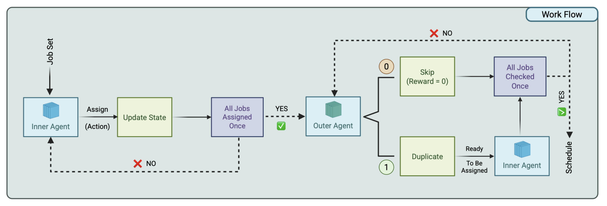
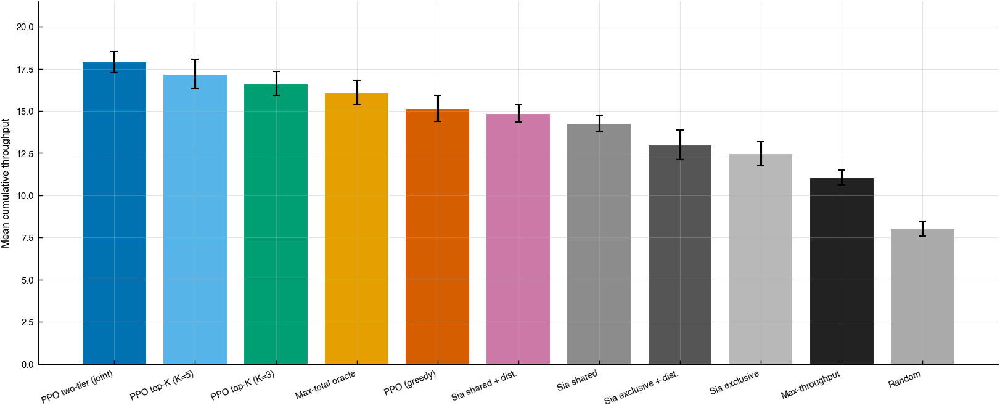

# RL-Based ML Job Scheduler with Distribution Optimization

This repository contains the code for an ML job scheduling system that uses a novel two-stage Hierarchical Reinforcement Learning (RL) approach based on the **Proximal Policy Optimization (PPO)** algorithm. The system is designed to efficiently assign Machine Learning training jobs to resources (servers and accelerators) while optimizing for job distributability to maximize overall throughput.

## Setup and Requirements

- **Python 3.10+** with `pip install -r requirements.txt` (`gymnasium`, `numpy`, `torch`, `matplotlib`, `scipy`).
  SciPy is needed only by `sia_baseline.py`, which solves Sia's allocation ILP with `scipy.optimize.milp`.
- **`physical_all.json` (474 KB, Gavel throughput table) must be present at the repository root.**
  It is loaded at runtime by `environment/_problem/problem.py` and is *gitignored* (large derived
  data file), so it is not committed — keep it or restore it from the Gavel dataset before running
  anything. Without it the environments cannot construct the throughput model.
- **`saved_job_sets/`** (committed) — the 20 fixed held-out job sets used for every evaluation.
- Device is auto-selected in `environment/ppo/core.py`: `cuda` → `mps` → `cpu`.

See **Quick Start** below for the commands to rerun the project, and
**Reproducing Everything from Scratch** for a detailed step-by-step walkthrough.

## Quick Start (how to rerun the project)

From a clean clone with `physical_all.json` and `saved_job_sets/` in place, the whole
pipeline is **six commands**:

```bash
# 0. environment
pip install -r requirements.txt

# 1. train the inner (placement) agent          -> models/job_scheduling/ppo/ (expect ~15.15)
python job_scheduling_ppo.py

# 2. train the outer (joint/duplication) agent  -> models/subset_selector/ppo/ (expect ~17.91)
python subset_selector_ppo.py

# 3. re-run every baseline + two-tier evaluation -> curves/job_scheduling/evaluation_scores_*.json
python eval_all_policies.py
python sia_baseline.py

# 4. regenerate all figures                     -> __paper/images/ + curves/figures/figures.json
python regen_paper_figs.py

# 5. benchmark online inference latency
python benchmark_inference.py
```

Steps 1–2 regenerate the **models**; steps 3–5 regenerate the **evaluation scores, figures,
and latency numbers**. Commands must run from the repository root and steps must run in
order (step 2 reads step 1's weights, steps 3–5 read step 2's artifacts).

## Project Architecture

The scheduling problem is modeled as a two-stage sequential decision process, each handled by a dedicated PPO agent:

1. **Primary Agent (Job Scheduling):** Assigns the current job to an available resource (server/accelerator pair).
2. **Secondary Agent (Distribution Selector):** Decides whether the newly assigned job should be distributed (duplicated) across additional resources to improve its estimated throughput, and if so, selects the location for the duplicate.

This structure allows the system to first satisfy basic resource constraints and then fine-tune the assignment for performance by considering distribution, resulting in a flexible and high-performing scheduler.



---

## Environments and Agents

The system uses two main environment classes, implemented using the Gymnasium library, and two PPO agents.

### 1. Job Scheduling Environment

This is the core environment focused on resource assignment.

* **Action Space (Primary Agent):** A discrete action corresponding to a flattened index of all possible (Server, Accelerator) pairs on the system.
* **State Space (Observation):** A comprehensive state vector including:

  * **GPU State:** Information about the jobs currently assigned to each GPU slot.
  * **Current Job:** One-hot encoding of the job's model and its batch size.
  * **Future Job Stats:** Statistics about upcoming jobs to aid in lookahead decisions.
  * **Jobs Left:** The number of jobs remaining in the current episode.
* **Constraint:** The environment enforces a co-location limit of a maximum of **two jobs** per single (server, accelerator) slot.

### 2. Distribution Selector Environment

This environment wraps the `JobSchedulingEnv` and introduces the distributability decision.

* **Action Space (Wrapper/Outer Step):**
  A discrete action with two choices:

  * `0`: **Skip** distribution, move to the next primary job.
  * `1`: **Duplicate** the job, triggering the Secondary Agent.
* **Secondary Agent Action:**
  If distribution is chosen, the Secondary Agent uses the same action space as the Primary Agent (a flattened resource index) to choose where to place the duplicate.

---

## Dataset

This project uses the **Gavel** dataset (Stanford FutureData Lab), which provides realistic ML job characteristics—including throughput, model types, batch-size effects, and multi-resource interactions.

Gavel repository:
**[https://github.com/stanford-futuredata/gavel](https://github.com/stanford-futuredata/gavel)**

We rely on Gavel’s job performance tables for accurate throughput estimation when assigning jobs and evaluating the impact of distribution across resources. The tables are materialized in `physical_all.json` at the repository root (24 job types × 3 accelerator types; see Setup above).

---

## Reward Mechanism

The overall goal is to maximize the cumulative job throughput. The reward in the core scheduling environment is designed to reflect the immediate impact of an assignment:

$$
\text{Reward} = \left(\frac{\text{New Throughput}}{100}, \frac{\text{Throughput Delta}}{100}\right)
$$

The `Throughput Delta` is calculated as the change in estimated throughput for all jobs affected by the current assignment (including co-located jobs).

### Distribution Penalty

To prevent unnecessary distribution, a penalty (discount) is applied when a job is duplicated:

* **Same Server Discount:** A smaller penalty applied if the duplicate is placed on the *same server* as an existing part of the job.
* **Cross Server Discount:** A larger penalty applied if the duplicate is placed on a *different server*, discouraging expensive cross-server communication unless the throughput gain is substantial.

This discount is subtracted from the `Throughput Delta` to ensure that distribution is only performed when the performance gain outweighs the infrastructural cost.

---

## Training and Evaluation

Both agents are implemented using standard PPO components, including Generalized Advantage Estimation (GAE) for stability and training on minibatches with multiple epochs.

### Training Strategy

The system employs a fine-tuning approach for the hierarchical agents:

1. **Initial Training:**
   The Primary Agent (Job Scheduler) is trained first to learn the base assignment logic.

2. **Hierarchical Fine-tuning:**
   The overall Secondary Agent training process **loads the pre-trained weights** of the Primary Agent and continues training both the Primary and Secondary Agents simultaneously.
   This ensures the foundational scheduling knowledge is retained while the agents jointly learn the optimal distribution policy.

### Evaluation

The performance of the trained agents is assessed on a fixed, independent set of job requests:

* **Job Sets:** Evaluation is conducted over **20 specified job sets** (`eval_episodes=20`, files `saved_job_sets/set_000.json` … `set_019.json`).
* **Metric:** The primary evaluation metric is the average cumulative reward (total throughput) achieved across all test episodes.
* **Scripts:** `eval_all_policies.py` re-runs random, the two Gavel greedy baselines, greedy PPO, top-K (K=3/5), and the trained two-tier (subset-selector) system; `sia_baseline.py` re-runs the four Sia configurations. Both overwrite `curves/job_scheduling/evaluation_scores_*.json` and print a `vs-committed diff` per policy to catch any drift from the reported numbers.
* **Online use:** Decisions require only the observable state (GPU occupancy, job model/batch size, queue statistics); no throughput table is queried at decision time. Inference runs in eager fp32 on CPU (see `deploy/online_actor.py`, benchmarked by `benchmark_inference.py`): inner forward pass ≈ 0.11 ms, full placement decision ≈ 0.54 ms, outer duplication decision ≈ 0.10 ms (M3 CPU medians). The inner forward pass is faster than the oracle's raw table lookups (~0.27 ms/decision) while requiring no throughput information — the `gavel_max_total` oracle needs exact true throughputs (including co-location interference) at runtime and therefore serves only as an offline upper bound.

---

## Performance Optimizations

### Bug Fixes & Speedups

| Fix | Impact |
|---|---|
| Fixed **CList doubled** (duplicate `prepare_problem()` call) | Correct combination enumeration |
| Replaced O(CList) linear scan with **O(1) dict lookup** for throughput estimation | **~2700× faster** per call |
| Fixed **secondary agent over-scheduling** (missing `break` on duplicate) | Prevents ~80 extra steps per episode |
| Fixed **dropout active during inference** — added `training=False` mode | Correct eval behavior |
| Shared buffer mutation fix — `flatten_obs` now returns `.copy()` | Correct observation propagation |
| **Primary agent frozen** during subset selector training | Stable hierarchical training |

### Architecture Improvements

| Change | Detail |
|---|---|
| Network **hidden size** | 256 → **1024** (3 layers with LayerNorm) |
| **Dropout** | 0.2 → **0.1** |
| **Clip annealing** | 0.2 → 0.1 over training |
| **Entropy schedule** | Start 0.05, decay 0.9995, min 0.005 |
| **Learning rate** | Actor 5e-4→1e-4, Critic 1e-3→2e-4 |
| **Batch size** | 64 → **128** |
| **Training episodes** | 15,000 (avg 55 jobs/ep, 20-90 range) |

### Observation Space Enhancements

| Feature | Dims | Purpose |
|---|---|---|
| GPU state (per-slot job encoding) | 540 | Existing — which jobs in each slot |
| **Occupancy** (per-slot count) | 45 | Explicit 0/1/2 fullness per slot |
| **Server load** (per-server utilization) | 15 | Jobs placed / max capacity per server |
| **Server model diversity** (unique models/server) | 15 | Model type spread across servers |
| Current job (one-hot + batch size) | 6 | Existing |
| Future job stats (min/max batch per model) | 10 | Existing |
| Jobs left | 1 | Existing |
| **Total observation dimension** | **632** | Up from original 557 |

---

## PPO Top-K Hybrid Search

The scheduler uses a **PPO-guided beam search** at test time: the PPO network proposes the top-K actions by probability, and the optimal among them is selected using the true reward function (`new_tp + delta`). This combines PPO's learned priors with exact optimization:

- **K=3** evaluates only **7%** of the action space (3/45 vs gavel's 45/45)
- Consistently **outperforms** the greedy gavel_max_total oracle

---

## Baselines

Four families of reference policy are evaluated on the same 20 held-out job sets.

| Baseline | Where | What it does |
|---|---|---|
| Random | `eval_all_policies.py` | Uniform choice among feasible slots |
| `gavel_max_throughput` | `eval_all_policies.py` | Greedily maximizes the current job's own throughput |
| `gavel_max_total` (oracle) | `eval_all_policies.py` | Greedily maximizes total throughput including co-location interference. Needs exact true throughputs at decision time, so it is an **offline upper bound for single-copy scheduling**, not a deployable scheduler |
| Sia | `sia_baseline.py` | Heterogeneity-aware, goodput-optimized ILP scheduler (SOSP '23) |

### Sia

`sia_baseline.py` reproduces Sia's actual scheduling formulation rather than a greedy
approximation of it. Per scheduling round it:

1. enumerates the valid configuration set `C` — one or two GPUs, by accelerator type, on one
   server or two;
2. builds the goodput matrix `G[job, config]` from the Gavel throughput tables;
3. row-normalizes it (Eq. 1), `G_ij ← N_i^min · G_ij / min_j G_ij`;
4. applies the restart factor `r_i` (Eq. 3) — here `r_i = 1`, since every job is scheduled once
   and never re-allocated;
5. solves Sia's binary ILP (Eq. 2 / Eq. 4) over the **whole queue at once** with
   `scipy.optimize.milp`, using the fairness exponent `p = -0.5` and `λ = 1.1`, subject to
   `‖A_i‖₁ ≤ 1` and per-accelerator-type capacity constraints.

A separate placement pass then maps the chosen configurations onto concrete `(server,
accelerator)` slots, most-constrained configurations first.

**Why the global ILP matters.** The capacity constraint in step 5 is what makes distribution
pay off: Sia gives a job a second GPU only once every other queued job has been served. A greedy
per-job rule that duplicates whenever the immediate gain looks positive spends slots that later
jobs need, and *loses* throughput. With the ILP, both of Sia's degrees of freedom behave as the
cluster model predicts:

| | single-GPU | + distribution | gain |
|---|---|---|---|
| exclusive GPUs | 12.48 | **12.99** | +0.51 |
| shared GPUs | 14.27 | **14.85** | +0.58 |

**Two variants.** Sia assumes exclusive GPUs, so `sia_original` (one job per GPU) is Sia as
published. `sia_colocated` is the shared-GPU extension: each GPU a configuration requests carries
a *level* — solo or shared — a shared GPU is priced at the job's mean co-located throughput over
the job types in the queue, and the ILP gains the constraints `share_X ≤ 2·y_X` and
`solo_X + y_X ≤ S` per accelerator type `X`, where `y_X` counts type-`X` GPUs run in shared mode.

**Information asymmetry.** Sia solves an ILP over the entire queue using exact throughput
profiles; the PPO agents decide online from observable state alone. Sia is therefore given
strictly more information than the policies it is compared against.

---

## Results

Comparison of scheduling policies on 20 held-out job sets:

| Policy | Mean ± Std | vs Oracle |
|---|---|---|
| **PPO Two-Tier (joint training)** | **17.91 ± 2.92** | **+1.80 ▲** |
| **PPO Top-K (K=5)** | **17.21 ± 3.84** | **+1.10 ▲** |
| **PPO Top-K (K=3)** | **16.61 ± 3.18** | **+0.51 ▲** |
| gavel_max_total (oracle) | 16.10 ± 3.20 | baseline |
| PPO (greedy) | 15.15 ± 3.48 | -0.95 |
| Sia — shared GPUs + distribution | 14.85 ± 2.29 | -1.25 |
| Sia — shared GPUs | 14.27 ± 2.11 | -1.84 |
| Sia — exclusive GPUs + distribution | 12.99 ± 3.97 | -3.11 |
| Sia — exclusive GPUs | 12.48 ± 3.20 | -3.62 |
| gavel_max_throughput | 11.06 ± 1.99 | -5.04 |
| Random | 8.03 ± 1.96 | -8.07 |

Std is the sample standard deviation (`ddof=1`) over the 20 held-out sets.



---

## Reproducing Everything from Scratch

The full pipeline — inner-agent training, joint (outer) training, baseline evaluation, figure
regeneration, and online-inference benchmarking — is script-driven. Run the steps **in order**:
later steps read artifacts produced by earlier ones.

### 0. Prerequisites

1. `pip install -r requirements.txt`
2. Confirm `physical_all.json` is at the repository root and `saved_job_sets/` is present
   (see **Setup and Requirements**).
3. *(Optional)* Reset committed reference artifacts before retraining. The training scripts
   **overwrite** the best checkpoints in `models/job_scheduling/ppo/` and
   `models/subset_selector/ppo/`, and the evaluation scripts **overwrite**
   `curves/job_scheduling/evaluation_scores_*.json`. To restore the committed reference models
   and curves afterwards:

       git checkout -- models/ curves/

   ⚠ Do **not** run `git clean -fdx` in this repository: the final deliverables (`__paper/`,
   `deploy/`, the evaluation/figure scripts, `curves/figures/`) are not tracked by git yet, so
   a clean would delete them. `models/job_scheduling/ppo/pretrained/` is never written by any
   script and always survives a rerun as a reference snapshot.

### 1. Train the inner agent (placement policy)

    python job_scheduling_ppo.py

- Trains the primary PPO scheduler for **15,000 episodes** (~55 jobs each), one gradient update
  every 2,048 steps, held-out evaluation every 300 episodes.
- The best checkpoint (by held-out mean reward) is written to
  `models/job_scheduling/ppo/actor.pth` and `critic.pth`; the final eval run also rewrites
  `curves/job_scheduling/evaluation_scores_ppo.json`.
- Training curve → `curves/job_scheduling/training_ppo.png|json`. Expect a final mean near
  **15.15** (the paper's inner-agent result).

### 2. Train the outer agent (joint training / duplication decisions)

    python subset_selector_ppo.py

- Builds the two-tier training environment, which loads the inner weights
  (`models/job_scheduling/ppo/actor.pth`) into a **frozen *primary* agent** (initial placement)
  and an initialized ***secondary* agent** (duplicate placement). The outer PPO policy learns
  *whether* to duplicate and *where*.
- **10,000 episodes**, held-out evaluation every 20 episodes. The best checkpoint (by eval total
  throughput) is saved to `models/subset_selector/ppo/actor.pth|critic.pth`. At every gradient
  update the fine-tuned secondary agent is saved to `models/job_scheduling/ppo/secondary/`.
- Curves → `curves/subset_selector/training_ppo.png|json` and `total_sum.png` /
  `eval_total_sum.json`. The best evaluation reached during training is **18.14**, but that
  score belongs to the outer actor paired with the *secondary* inner agent as it stood at that
  moment; the secondary agent keeps being overwritten afterwards, so re-evaluating the committed
  checkpoint pair in step 3 gives **17.91**. The re-evaluated number is the one reported.

### 3. Re-run all baseline and two-tier evaluations

    python eval_all_policies.py     # random, gavel_max_throughput, gavel_max_total, PPO greedy, top-K (K=3/5), two-tier
    python sia_baseline.py          # Sia (exclusive/shared × ±distribution)

Both overwrite `curves/job_scheduling/evaluation_scores_*.json` and print a per-policy
`vs-committed diff`, so any deviation from the reported numbers is flagged immediately.

Expected means: two-tier **17.91**, top-K K=5 **17.21**, top-K K=3 **16.61**, max-total
oracle **16.10**, PPO greedy **15.15**, Sia shared+dist **14.85**, Sia shared **14.27**,
Sia exclusive+dist **12.99**, Sia exclusive **12.48**, max-throughput **11.06**, random **8.03**.

### 4. Regenerate all figures

    python regen_paper_figs.py              # re-read raw eval/training JSONs → save curves/figures/figures.json → render
    python regen_paper_figs.py --plot-only  # re-render every figure from curves/figures/figures.json alone

Writes publication-quality vector figures to `__paper/images/` (plus the README bitmap
`curves/job_scheduling/policy_comparison.png`). The self-contained data snapshot in
`curves/figures/figures.json` is committed, so every plot can be reproduced even without any
raw eval JSONs.

### 5. Benchmark online inference

    python benchmark_inference.py

Reports median/mean latency of the inner forward pass, full placement decision, and outer
duplication decision (MPS vs CPU eager), and verifies that the CPU deploy paths
(`deploy/online_actor.py`) produce actions **identical** to the reference greedy policies used
for the reported scores.

### 6. Rebuild the papers

    cd __paper && pdflatex main.tex && pdflatex main.tex
    cd __paper && pdflatex EWRL2026_TwoTier_RL_Formatted.tex && pdflatex EWRL2026_TwoTier_RL_Formatted.tex

(Run twice so cross-references — `fig:policy_comparison`, `fig:two_tier_per_set`, … — resolve.)

### Model artifacts at a glance

| Path | What it is |
|---|---|
| `models/job_scheduling/ppo/actor.pth` · `critic.pth` | Inner (primary placement) PPO — best by held-out eval (mean ≈ 15.15) |
| `models/job_scheduling/ppo/secondary/` | Inner agent fine-tuned during joint training for duplicate placements (used by the two-tier eval) |
| `models/job_scheduling/ppo/pretrained/` | Pre-joint-training snapshot of the inner agent (kept for comparison) |
| `models/subset_selector/ppo/actor.pth` · `critic.pth` | Outer (duplication-decision) PPO — best by eval total throughput (two-tier mean ≈ 17.91) |

### Reproducibility notes

- A global seed (`SEED = 42`) is fixed in `environment/ppo/core.py`; evaluation always walks the
  20 held-out sets in deterministic order (`set_000` … `set_019`, no shuffling), so runs are stable.
- `eval_all_policies.py` and `sia_baseline.py` intentionally overwrite the committed score JSONs
  and print diffs — run them as a *verification* that you reproduce the paper's numbers before
  changing anything.
- Training length is the main lever on runtime: step 1 runs ~825k environment steps
  (15,000 episodes × ~55 jobs), step 2 runs 10,000 two-tier episodes with an evaluation
  (20 episodes over the held-out sets) every 20 episodes.

### Verification checklist

After a full rerun, confirm each artifact matches the committed values:

| Step | Artifact | Expected |
|---|---|---|
| 1 | `curves/job_scheduling/evaluation_scores_ppo.json` mean | ≈ **15.15** |
| 2 | `curves/subset_selector/eval_total_sum.json` max (best during training) | ≈ **18.14** |
| 3 | `curves/job_scheduling/evaluation_scores_subset_selector.json` mean | ≈ **17.91** |
| 3 | `..._gavel_max_total.json` mean | ≈ **16.10** |
| 3 | `..._ppo_topk_k5.json` mean | ≈ **17.21** |
| 3 | `..._sia_colocated_dist.json` mean | ≈ **14.85** (must exceed `..._sia_colocated.json` ≈ **14.27**) |
| 3 | `..._sia_original_dist.json` mean | ≈ **12.99** (must exceed `..._sia_original.json` ≈ **12.48**) |
| 4 | `curves/figures/figures.json` + `__paper/images/*.pdf` | regenerated, byte-identical via `--plot-only` |
| 5 | `benchmark_inference.py` output | inner ≈ 0.11 ms / decision ≈ 0.54 ms / outer ≈ 0.10 ms |

---
