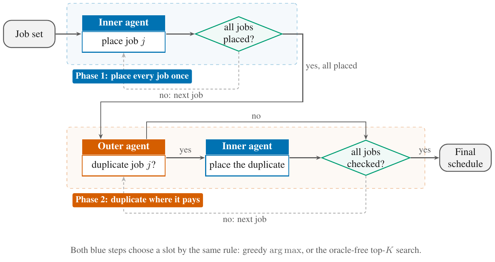
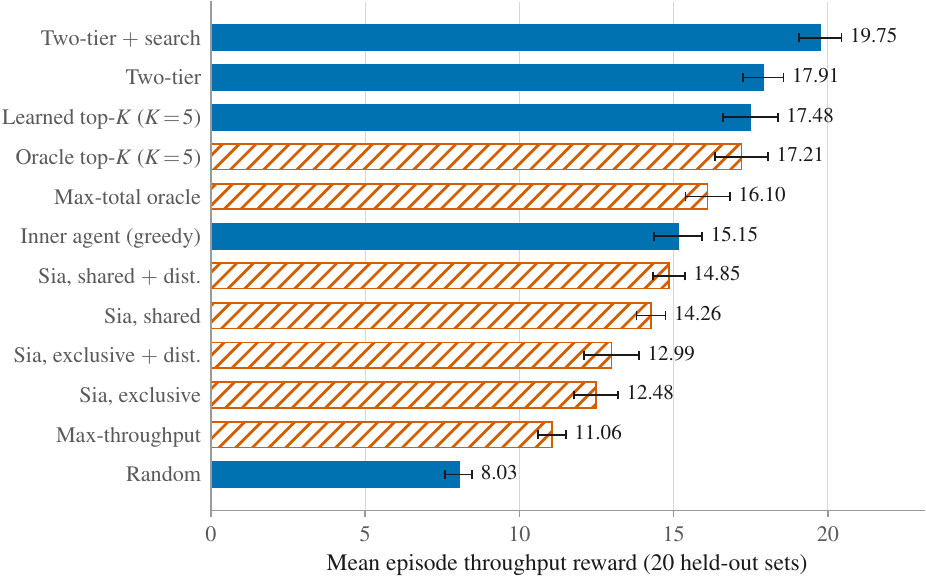

# RL-Based ML Job Scheduler for Heterogeneous GPU Clusters

A two-tier reinforcement-learning scheduler that places deep-learning training jobs
on a heterogeneous GPU cluster (K80, P100, V100) using the
[Gavel](https://github.com/stanford-futuredata/gavel) throughput measurements. An
**inner PPO agent** places each job on a GPU, which may be shared with a second job.
An **outer PPO agent** then decides which jobs get a second copy on another GPU. An
**oracle-free top-K search** re-ranks the inner agent's most likely actions with a
learned reward model, so no throughput table is read at decision time.

**Full report:** [`report/report.pdf`](report/report.pdf) (23 pages: problem
formulation and NP-hardness, method, results, ablations and negative results).
Implementation details, every experiment and the full reproduction walkthrough are in
[`docs/TECHNICAL_NOTES.md`](docs/TECHNICAL_NOTES.md).



## Results

Mean episode throughput reward over the 20 held-out job sets in
`data/saved_job_sets/` (± sample standard deviation over sets):

| Policy | Mean ± std | Needs throughput data at decision time? |
|---|---|---|
| **Two-tier + oracle-free search** | **19.76 ± 3.08** | no |
| **Two-tier (inner + outer agent)** | **17.91 ± 2.92** | no |
| **Oracle-free top-K search (K = 5)** | **17.48 ± 4.00** | no |
| Oracle top-K search (K = 5) | 17.21 ± 3.84 | yes: true co-location throughputs |
| Max-total greedy oracle (`gavel_max_total`) | 16.10 ± 3.20 | yes: true co-location throughputs |
| Inner agent alone (greedy) | 15.15 ± 3.48 | no |
| Sia, shared GPUs + distribution | 14.85 ± 2.29 | yes: throughput profiles |
| Sia, exclusive GPUs (as published) | 12.48 ± 3.20 | yes: throughput profiles |
| Max-throughput greedy (`gavel_max_throughput`) | 11.06 ± 1.99 | yes |
| Random | 8.03 ± 1.96 | no |



Main findings:

- **Two tiers beat one.** Letting a second agent add copies raises the inner agent's
  15.15 to 17.91. That is above the max-total oracle and above Sia, which solves an
  ILP over the whole queue with exact profiles.
- **The inner agent loses on near-ties, not on what it ranks.** Re-scoring only its
  top 5 actions with the true reward already beats the full-space oracle (17.21 vs 16.10).
- **That refinement needs no oracle.** The placement reward is determined exactly by
  an 18-dimensional key read from the scheduler's own bookkeeping. A small network
  over that key predicts it with R² = 0.99972, and the resulting search matches the
  oracle-assisted one (17.48 vs 17.21; +1.38 over the greedy oracle, paired t = 4.70).
- **Negative results, reported in full.** Learned value and Q-heads, and continual
  online policy updates, did not help (report, Sections 7–8).

## Quick start

```bash
python3 -m venv .venv && .venv/bin/pip install -r requirements.txt

# self-checks: exact reward-equivalence classes and the fast observation builder
.venv/bin/python -m scheduler.search.canonicalization
.venv/bin/python -m scheduler.search.fast_obs

# evaluate every policy on the 20 held-out sets (needs the trained models in models/)
.venv/bin/python -m scripts.evaluate
.venv/bin/python -m scripts.sia_baseline

# regenerate the report figures from results/, then build the report
.venv/bin/python -m scripts.figures
cd report && pdflatex report && bibtex report && pdflatex report && pdflatex report
```

Training from scratch (`scripts.train_inner`, `scripts.train_outer`,
`scripts.train_reward_model`, `scripts.online_learning`) is described step by step in
[`docs/TECHNICAL_NOTES.md`](docs/TECHNICAL_NOTES.md#reproducing-everything-from-scratch).
Checkpoints are kept out of git (`models/` is ignored).

## Repository layout

| Path | Contents |
|---|---|
| `scheduler/envs/` | Job-scheduling and duplication (subset-selector) environments, Gavel throughput model |
| `scheduler/agents/` | PPO implementation and checkpoint loading |
| `scheduler/search/` | Top-K search, the 18-d key (canonicalisation), reward/value/Q heads, two-tier pipeline |
| `scheduler/online/` | Continual online learner with its safety guards |
| `scripts/` | Training, evaluation, Sia baseline, benchmarks, figures |
| `data/` | Gavel throughput table (`physical_all.json`) and the 20 held-out job sets |
| `results/` | Stored evaluation scores and figure data behind every reported number |
| `report/` | Report source, figures and the built PDF |
| `docs/TECHNICAL_NOTES.md` | Detailed design, experiments, ablations and reproduction guide |

## Reproducibility and caveats

- Rerunning `scripts.evaluate` with the stored checkpoints reproduces every number in
  `results/job_scheduling/` exactly. `scripts.sia_baseline` matches to within 0.02:
  the MILP solver bundled with recent SciPy picks a slightly different optimum on a
  few sets (shared + distribution: 14.83 vs 14.85).
- Results come from **one training seed**.
- The inner and outer agents' checkpoints were chosen by their score on the test
  sets. Every configuration introduced later (top-K, scoring heads) was selected on
  separate validation sets. **Two-tier vs. search is therefore the one comparison not
  to treat as settled**; see "A note on model selection" in the technical notes.
- Throughputs come from the Gavel table, and co-location interference is modelled
  from it. There is no real-cluster run.

## Author

Ali Ahmadi Esfidi, Department of Mathematics and Computer Science, Amirkabir
University of Technology.
